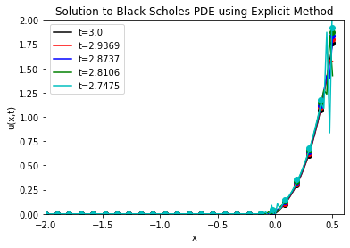
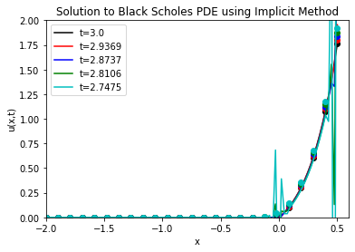
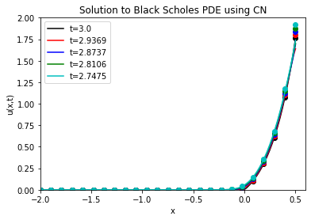
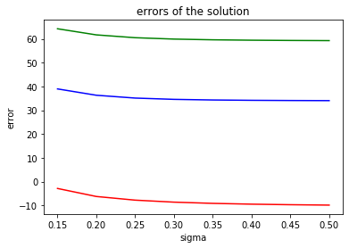

```python
import numpy
import numpy as np
import matplotlib.pyplot as plt
import scipy.sparse as sparse
import scipy.sparse.linalg as linalg
from scipy import stats
from scipy.stats import norm


# Compute Heat Equation Solution using Explicit Method
# Spatial discretization
m = 100
x = numpy.linspace(-2, 0.5, m)
delta_x = 2.5 / (m - 1.0)

# Time discretization - Choose \Delta t based on accuracy constraints
C = 0.05
delta_t = C * delta_x
t = numpy.arange(0.0, 0.06, delta_t)
N = len(t)
r=0.1
sigma=0.2
T=3
K=100
k=2*r/sigma**2
alpha=(1-k)/2
beta=-(k+1)**2/4
# Solution array
U = numpy.empty((N + 1, m))

#initial condition
for i in range(m):
    if x[i]>0:
        U[0,i]=(np.exp(x[i])-1)/np.exp(alpha*x[i])
    else:
        U[0,i]=0

#boundary condition
t_true=lambda t: T-2*t/sigma**2
d1=lambda a,t: (a+(r+1/2*sigma**2)*(T-t_true(t)))/sigma/np.sqrt(T-t_true(t))#use tau here
d2=lambda a,t: (a+(r-1/2*sigma**2)*(T-t_true(t)))/sigma/np.sqrt(T-t_true(t))

u_true = lambda x, t:  (np.exp(x)*norm.cdf(d1(x,t))-np.exp(-r*(T-t_true(t)))*norm.cdf(d2(x,t)))/np.exp(alpha*x+beta*t)
g_0=u_true(-2,t)
g_1=u_true(0.5,t)

# Build solving matrix
e = numpy.ones(m) * delta_t / (2.0 * delta_x**2)
B = sparse.spdiags([e, 1.0 - 2.0 * e, e], [-1, 0, 1],  m, m).tocsr()

# Time stepping loop
for n in range(len(t)-1):
    # Construct right-hand side
    b = B.dot(U[n, :])
    b[0] += delta_t / (2.0 * delta_x**2) * (g_0[n])
    b[-1] += delta_t / (2.0 * delta_x**2) * (g_1[n])
    
    # Solve system
    U[n+1, :] = b

x_fine = numpy.linspace(-2, 0.5, 25)

y=numpy.empty(len(t))
for i in range(len(t)):
    y[i]=(U[i,:]-u_true(x,t[i])).dot(U[i,:]-u_true(x,t[i]))/len(x)
fig = plt.figure()
axes = fig.add_subplot(1, 1, 1)
axes.plot(t,y)
axes.set_xlabel("tau")
axes.set_ylabel("error")
axes.set_title("errors of the solution")

# Plot a few solutions
colors = ['k', 'r', 'b', 'g', 'c']
fig = plt.figure()
axes = fig.add_subplot(1, 1, 1)
for (i, n) in enumerate((0, 1, 2, 3, 4)):
    axes.plot(x, U[n, :], colors[n], label='t=%s' % numpy.round(T-2*t[n]/sigma**2, 4))
    axes.plot(x_fine,u_true(x_fine,t[n]),"o%s"%colors[n])
    axes.set_xlabel("x")
    axes.set_ylabel("u(x,t)")
    axes.set_title("Solution to Black Scholes PDE using Explicit Method")
    axes.set_xlim([-2,0.6])
    axes.set_ylim([0,2])
    axes.legend()
plt.show()
```

    /opt/anaconda3/lib/python3.7/site-packages/ipykernel_launcher.py:40: RuntimeWarning: divide by zero encountered in true_divide
    /opt/anaconda3/lib/python3.7/site-packages/ipykernel_launcher.py:41: RuntimeWarning: divide by zero encountered in true_divide
    /opt/anaconda3/lib/python3.7/site-packages/ipykernel_launcher.py:40: RuntimeWarning: divide by zero encountered in true_divide
    /opt/anaconda3/lib/python3.7/site-packages/ipykernel_launcher.py:41: RuntimeWarning: divide by zero encountered in true_divide





```python
import numpy
import numpy as np
import matplotlib.pyplot as plt
import scipy.sparse as sparse
import scipy.sparse.linalg as linalg
from scipy import stats
from scipy.stats import norm


# Compute Heat Equation Solution using Implicit Method
# Spatial discretization
m = 100
x = numpy.linspace(-2, 0.5, m)
delta_x = 2.5 / (m - 1.0)

# Time discretization - Choose \Delta t based on accuracy constraints
C = 0.05
delta_t = C * delta_x
t = numpy.arange(0.0, 0.06, delta_t)
N = len(t)
r=0.1
sigma=0.2
T=3
K=100
k=2*r/sigma**2
alpha=(1-k)/2
beta=-(k+1)**2/4
# Solution array
U = numpy.empty((N + 1, m))

#initial condition
for i in range(m):
    if x[i]>0:
        U[0,i]=(np.exp(x[i])-1)/np.exp(alpha*x[i])
    else:
        U[0,i]=0

#boundary condition
t_true=lambda t: T-2*t/sigma**2
d1=lambda a,t: (a+(r+1/2*sigma**2)*(T-t_true(t)))/sigma/np.sqrt(T-t_true(t))#use tau here
d2=lambda a,t: (a+(r-1/2*sigma**2)*(T-t_true(t)))/sigma/np.sqrt(T-t_true(t))

u_true = lambda x, t:  (np.exp(x)*norm.cdf(d1(x,t))-np.exp(-r*(T-t_true(t)))*norm.cdf(d2(x,t)))/np.exp(alpha*x+beta*t)
g_0=u_true(-2,t)
g_1=u_true(0.5,t)

# Build solving matrix
e = numpy.ones(m) * delta_t / (2.0 * delta_x**2)
A = sparse.spdiags([-e, 1.0 + 2.0 * e, -e], [-1, 0, 1], m, m).tocsr()

# Time stepping loop
for n in range(len(t)-1):
    # Construct right-hand side
    b = A.dot(U[n, :])
    b[0] -= delta_t / (2.0 * delta_x**2) * (g_0[n])
    b[-1] -= delta_t / (2.0 * delta_x**2) * (g_1[n])
    
    # Solve system
    U[n+1, :] = b

x_fine = numpy.linspace(-2, 0.5, 25)

y=numpy.empty(len(t))
for i in range(len(t)):
    y[i]=(U[i,:]-u_true(x,t[i])).dot(U[i,:]-u_true(x,t[i]))/len(x)
fig = plt.figure()
axes = fig.add_subplot(1, 1, 1)
axes.plot(t,y)
axes.set_xlabel("tau")
axes.set_ylabel("error")
axes.set_title("errors of the solution")
colors = ['k', 'r', 'b', 'g', 'c']
fig = plt.figure()
axes = fig.add_subplot(1, 1, 1)
for (i, n) in enumerate((0, 1, 2, 3, 4)):
    axes.plot(x, U[n, :], colors[n], label='t=%s' % numpy.round(T-2*t[n]/sigma**2, 4))
    axes.plot(x_fine,u_true(x_fine,t[n]),"o%s"%colors[n])
    axes.set_xlabel("x")
    axes.set_ylabel("u(x,t)")
    axes.set_title("Solution to Black Scholes PDE using Implicit Method")
    axes.set_xlim([-2,0.6])
    axes.set_ylim([0,2])
    axes.legend()
plt.show()
```

    /opt/anaconda3/lib/python3.7/site-packages/ipykernel_launcher.py:40: RuntimeWarning: divide by zero encountered in true_divide
    /opt/anaconda3/lib/python3.7/site-packages/ipykernel_launcher.py:41: RuntimeWarning: divide by zero encountered in true_divide
    /opt/anaconda3/lib/python3.7/site-packages/ipykernel_launcher.py:40: RuntimeWarning: divide by zero encountered in true_divide
    /opt/anaconda3/lib/python3.7/site-packages/ipykernel_launcher.py:41: RuntimeWarning: divide by zero encountered in true_divide





```python
import numpy
import numpy as np
import matplotlib.pyplot as plt
import scipy.sparse as sparse
import scipy.sparse.linalg as linalg
from scipy import stats
from scipy.stats import norm


# Compute Heat Equation Solution using Crank-Nicholson
# Spatial discretization
m = 100
x = numpy.linspace(-2, 0.5, m)
delta_x = 2.5 / (m - 1.0)

# Time discretization - Choose \Delta t based on accuracy constraints
C = 0.05
delta_t = C * delta_x
t = numpy.arange(0.0, 0.06, delta_t)
N = len(t)
r=0.1
sigma=0.2
T=3
K=100
k=2*r/sigma**2
alpha=(1-k)/2
beta=-(k+1)**2/4
# Solution array
U = numpy.empty((N + 1, m))

#initial condition
for i in range(m):
    if x[i]>0:
        U[0,i]=(np.exp(x[i])-1)/np.exp(alpha*x[i])
    else:
        U[0,i]=0

#boundary condition
t_true=lambda t: T-2*t/sigma**2
d1=lambda a,t: (a+(r+1/2*sigma**2)*(T-t_true(t)))/sigma/np.sqrt(T-t_true(t))#use tau here
d2=lambda a,t: (a+(r-1/2*sigma**2)*(T-t_true(t)))/sigma/np.sqrt(T-t_true(t))

u_true = lambda x, t:  (np.exp(x)*norm.cdf(d1(x,t))-np.exp(-r*(T-t_true(t)))*norm.cdf(d2(x,t)))/np.exp(alpha*x+beta*t)
g_0=u_true(-2,t)
g_1=u_true(0.5,t)

# Build solving matrix
e = numpy.ones(m) * delta_t / (2.0 * delta_x**2)
A = sparse.spdiags([-e, 1.0 + 2.0 * e, -e], [-1, 0, 1], m, m).tocsr()
# Build matrix for the right hand side computation
# Note that we also have to deal with boundary conditions in the actual loop
# since they could be time dependent
B = sparse.spdiags([e, 1.0 - 2.0 * e, e], [-1, 0, 1],  m, m).tocsr()

# Time stepping loop
for n in range(len(t)-1):
    # Construct right-hand side
    b = B.dot(U[n, :])
    b[0] += delta_t / (2.0 * delta_x**2) * (g_0[n] + g_0[n+1])
    b[-1] += delta_t / (2.0 * delta_x**2) * (g_1[n] + g_1[n+1])
    
    # Solve system
    U[n+1, :] = linalg.spsolve(A, b)

x_fine = numpy.linspace(-2, 0.5, 25)
y=numpy.empty(len(t))
for i in range(len(t)):
    y[i]=(U[i,:]-u_true(x,t[i])).dot(U[i,:]-u_true(x,t[i]))/len(x)
fig = plt.figure()
axes = fig.add_subplot(1, 1, 1)
axes.plot(t,y)
axes.set_xlabel("tau")
axes.set_ylabel("error")
axes.set_title("errors of the solution")
# Plot a few solutions
colors = ['k', 'r', 'b', 'g', 'c']
fig = plt.figure()
axes = fig.add_subplot(1, 1, 1)
for (i, n) in enumerate((0, 1, 2, 3, 4)):
    axes.plot(x, U[n, :], colors[n], label='t=%s' % numpy.round(T-2*t[n]/sigma**2, 4))
    axes.plot(x_fine,u_true(x_fine,t[n]),"o%s"%colors[n])
    axes.set_xlabel("x")
    axes.set_ylabel("u(x,t)")
    axes.set_title("Solution to Black Scholes PDE using CN")
    axes.set_xlim([-2,0.6])
    axes.set_ylim([0,2])
    axes.legend()
plt.show()
```

    /opt/anaconda3/lib/python3.7/site-packages/ipykernel_launcher.py:40: RuntimeWarning: divide by zero encountered in true_divide
    /opt/anaconda3/lib/python3.7/site-packages/ipykernel_launcher.py:41: RuntimeWarning: divide by zero encountered in true_divide
    /opt/anaconda3/lib/python3.7/site-packages/ipykernel_launcher.py:40: RuntimeWarning: divide by zero encountered in true_divide
    /opt/anaconda3/lib/python3.7/site-packages/ipykernel_launcher.py:41: RuntimeWarning: divide by zero encountered in true_divide





```python
#compute relative error of these three methods with changing of volatility
def solve_bs_error_cn(sigma):
# Compute Heat Equation Solution using Crank-Nicholson
# Spatial discretization
    m = 100
    x = numpy.linspace(-2, 0.5, m)
    delta_x = 2.5 / (m - 1.0)

# Time discretization - Choose \Delta t based on accuracy constraints
    C = 0.05
    delta_t = C * delta_x
    t = numpy.arange(0.0, 0.06, delta_t)
    N = len(t)
    r=0.1
    T=3
    K=100
    k=2*r/sigma**2
    alpha=(1-k)/2
    beta=-(k+1)**2/4
    # Solution array
    U = numpy.empty((N + 1, m))

    #initial condition
    for i in range(m):
        if x[i]>0:
            U[0,i]=(np.exp(x[i])-1)/np.exp(alpha*x[i])
        else:
            U[0,i]=0

#boundary condition
    t_true=lambda t: T-2*t/sigma**2
    d1=lambda a,t: (a+(r+1/2*sigma**2)*(T-t_true(t)))/sigma/np.sqrt(T-t_true(t))#use tau here
    d2=lambda a,t: (a+(r-1/2*sigma**2)*(T-t_true(t)))/sigma/np.sqrt(T-t_true(t))

    u_true = lambda x, t:  (np.exp(x)*norm.cdf(d1(x,t))-np.exp(-r*(T-t_true(t)))*norm.cdf(d2(x,t)))/np.exp(alpha*x+beta*t)
    g_0=u_true(-2,t)
    g_1=u_true(0.5,t)

# Build solving matrix
    e = numpy.ones(m) * delta_t / (2.0 * delta_x**2)
    A = sparse.spdiags([-e, 1.0 + 2.0 * e, -e], [-1, 0, 1], m, m).tocsr()
# Build matrix for the right hand side computation
# Note that we also have to deal with boundary conditions in the actual loop
# since they could be time dependent
    B = sparse.spdiags([e, 1.0 - 2.0 * e, e], [-1, 0, 1],  m, m).tocsr()

# Time stepping loop
    for n in range(len(t)-1):
    # Construct right-hand side
        b = B.dot(U[n, :])
        b[0] += delta_t / (2.0 * delta_x**2) * (g_0[n] + g_0[n+1])
        b[-1] += delta_t / (2.0 * delta_x**2) * (g_1[n] + g_1[n+1])
    
    # Solve system
        U[n+1, :] = linalg.spsolve(A, b)
    
    return(U[-25,:]-u_true(x,t[-25])).dot(U[-25,:]-u_true(x,t[-25]))/len(x)

def solve_bs_error_explicit(sigma):
# Compute Heat Equation Solution using Crank-Nicholson
# Spatial discretization
    m = 100
    x = numpy.linspace(-2, 0.5, m)
    delta_x = 2.5 / (m - 1.0)

# Time discretization - Choose \Delta t based on accuracy constraints
    C = 0.05
    delta_t = C * delta_x
    t = numpy.arange(0.0, 0.06, delta_t)
    N = len(t)
    r=0.1
    T=3
    K=100
    k=2*r/sigma**2
    alpha=(1-k)/2
    beta=-(k+1)**2/4
    # Solution array
    U = numpy.empty((N + 1, m))

    #initial condition
    for i in range(m):
        if x[i]>0:
            U[0,i]=(np.exp(x[i])-1)/np.exp(alpha*x[i])
        else:
            U[0,i]=0

#boundary condition
    t_true=lambda t: T-2*t/sigma**2
    d1=lambda a,t: (a+(r+1/2*sigma**2)*(T-t_true(t)))/sigma/np.sqrt(T-t_true(t))#use tau here
    d2=lambda a,t: (a+(r-1/2*sigma**2)*(T-t_true(t)))/sigma/np.sqrt(T-t_true(t))

    u_true = lambda x, t:  (np.exp(x)*norm.cdf(d1(x,t))-np.exp(-r*(T-t_true(t)))*norm.cdf(d2(x,t)))/np.exp(alpha*x+beta*t)
    g_0=u_true(-2,t)
    g_1=u_true(0.5,t)

# Build solving matrix
    e = numpy.ones(m) * delta_t / (2.0 * delta_x**2)
    B = sparse.spdiags([e, 1.0 - 2.0 * e, e], [-1, 0, 1],  m, m).tocsr()

# Time stepping loop
    for n in range(len(t)-1):
    # Construct right-hand side
        b = B.dot(U[n, :])
        b[0] += delta_t / (2.0 * delta_x**2) * (g_0[n])
        b[-1] += delta_t / (2.0 * delta_x**2) * (g_1[n])
    
    # Solve system
        U[n+1, :] = b
    
    return(U[-25,:]-u_true(x,t[-25])).dot(U[-25,:]-u_true(x,t[-25]))/len(x)

def solve_bs_error_implicit(sigma):
# Compute Heat Equation Solution using Crank-Nicholson
# Spatial discretization
    m = 100
    x = numpy.linspace(-2, 0.5, m)
    delta_x = 2.5 / (m - 1.0)

# Time discretization - Choose \Delta t based on accuracy constraints
    C = 0.05
    delta_t = C * delta_x
    t = numpy.arange(0.0, 0.06, delta_t)
    N = len(t)
    r=0.1
    T=3
    K=100
    k=2*r/sigma**2
    alpha=(1-k)/2
    beta=-(k+1)**2/4
    # Solution array
    U = numpy.empty((N + 1, m))

    #initial condition
    for i in range(m):
        if x[i]>0:
            U[0,i]=(np.exp(x[i])-1)/np.exp(alpha*x[i])
        else:
            U[0,i]=0

#boundary condition
    t_true=lambda t: T-2*t/sigma**2
    d1=lambda a,t: (a+(r+1/2*sigma**2)*(T-t_true(t)))/sigma/np.sqrt(T-t_true(t))#use tau here
    d2=lambda a,t: (a+(r-1/2*sigma**2)*(T-t_true(t)))/sigma/np.sqrt(T-t_true(t))

    u_true = lambda x, t:  (np.exp(x)*norm.cdf(d1(x,t))-np.exp(-r*(T-t_true(t)))*norm.cdf(d2(x,t)))/np.exp(alpha*x+beta*t)
    g_0=u_true(-2,t)
    g_1=u_true(0.5,t)

# Build solving matrix
    e = numpy.ones(m) * delta_t / (2.0 * delta_x**2)
    A = sparse.spdiags([-e, 1.0 + 2.0 * e, -e], [-1, 0, 1], m, m).tocsr()

# Time stepping loop
    for n in range(len(t)-1):
    # Construct right-hand side
        b = A.dot(U[n, :])
        b[0] -= delta_t / (2.0 * delta_x**2) * (g_0[n])
        b[-1] -= delta_t / (2.0 * delta_x**2) * (g_1[n])
    
    # Solve system
        U[n+1, :] = b
    
    return(U[-25,:]-u_true(x,t[-25])).dot(U[-25,:]-u_true(x,t[-25]))/(len(x))

sigma=[0.15,0.2,0.25,0.3,0.35,0.4,0.45,0.5]
error=numpy.empty((3,len(sigma)))
for i in range(len(sigma)):
    error[0,i]=numpy.log(solve_bs_error_cn(sigma[i]))
    error[1,i]=numpy.log(solve_bs_error_explicit(sigma[i]))
    error[2,i]=numpy.log(solve_bs_error_implicit(sigma[i]))
fig = plt.figure()
axes = fig.add_subplot(1, 1, 1)
axes.plot(sigma,error[0,:],'r')
axes.plot(sigma,error[1,:],'b')
axes.plot(sigma,error[2,:],'g')
axes.set_xlabel("sigma")
axes.set_ylabel("error")
axes.set_title("errors of the solution")
```

    /opt/anaconda3/lib/python3.7/site-packages/ipykernel_launcher.py:32: RuntimeWarning: divide by zero encountered in true_divide
    /opt/anaconda3/lib/python3.7/site-packages/ipykernel_launcher.py:33: RuntimeWarning: divide by zero encountered in true_divide
    /opt/anaconda3/lib/python3.7/site-packages/ipykernel_launcher.py:89: RuntimeWarning: divide by zero encountered in true_divide
    /opt/anaconda3/lib/python3.7/site-packages/ipykernel_launcher.py:90: RuntimeWarning: divide by zero encountered in true_divide
    /opt/anaconda3/lib/python3.7/site-packages/ipykernel_launcher.py:142: RuntimeWarning: divide by zero encountered in true_divide
    /opt/anaconda3/lib/python3.7/site-packages/ipykernel_launcher.py:143: RuntimeWarning: divide by zero encountered in true_divide


    Text(0.5, 1.0, 'errors of the solution')





```python
import numpy as np
import pandas as pd
from scipy.stats import norm
import scipy.interpolate as spi
import scipy.sparse as sp
import scipy.linalg as sla
from scipy.sparse.linalg import inv
from scipy.sparse.linalg import spsolve
import matplotlib as mpl
import matplotlib.pyplot as plt
import matplotlib.ticker as ticker
%matplotlib inline
mpl.rcParams['font.sans-serif'] = ['Microsoft YaHei']
mpl.rcParams['axes.unicode_minus'] = False

np.random.seed(1031)
dt_hex = '#2B4750'    # dark teal,  RGB = 43,71,80
r_hex = '#DC2624'     # red,        RGB = 220,38,36
g_hex = '#649E7D'     # green,      RGB = 100,158,125
tl_hex = '#45A0A2'    # teal,       RGB = 69,160,162
tn_hex = '#C89F91'    # tan,        RGB = 200,159,145
```


```python
def blackscholes( S0=100, K=100, r=0.01, q=0.01, T=1, sigma=0.2, omega=1 ):
    discount = np.exp(-r*T)
    forward = S0*np.exp((r-q)*T)
    moneyness = np.log(forward/K)
    vol_sqrt_T = sigma*np.sqrt(T)
    
    d1 = moneyness / vol_sqrt_T + 0.5*vol_sqrt_T
    d2 = d1 - vol_sqrt_T
    
    V = omega * discount * (forward*norm.cdf(omega*d1) - K*norm.cdf(omega*d2))
    return V
```


```python
(S, K, r, q, T, sigma, option_type) = (50, 60, 0.03, 0.01, 1, 0.4, 'put')
(Smin, Smax, Ns, Nt) = (0, 4*np.maximum(S,K), 200, 200)
class OptionPricingMethod():
    
    def __init__(self, S, K, r, q, T, sigma, option_type):
        self.S = S
        self.K = K
        self.r = r
        self.q = q
        self.T = T
        self.sigma = sigma
        self.option_type = option_type
        self.is_call = (option_type[0].lower()=='c')
        self.omega = 1 if self.is_call else -1
```


```python
class FiniteDifference(OptionPricingMethod):
    
    def __init__(self, S, K, r, q, T, sigma, option_type, Smin, Smax, Ns, Nt):
        super().__init__(S, K, r, q, T, sigma, option_type)
        self.Smin = Smin
        self.Smax = Smax
        self.Ns = int(Ns)
        self.Nt = int(Nt)
        self.dS = (Smax-Smin)/Ns * 1.0
        self.dt = T/Nt*1.0
        self.Svec = np.linspace(Smin, Smax, self.Ns+1)
        self.Tvec = np.linspace(0, T, self.Nt+1)
        self.grid = np.zeros(shape=(self.Ns+1, self.Nt+1))
        
    def _set_terminal_condition_(self):
        self.grid[:, -1] = np.maximum(self.omega*(self.Svec - self.K), 0)
    
    def _set_boundary_condition_(self):
        tau = self.Tvec[-1] - self.Tvec;     
        DFq = np.exp(-q*tau)
        DFr = np.exp(-r*tau)

        self.grid[0,  :] = np.maximum(self.omega*(self.Svec[0]*DFq - self.K*DFr), 0)
        self.grid[-1, :] = np.maximum(self.omega*(self.Svec[-1]*DFq - self.K*DFr), 0)        
        
    def _set_coefficient__(self):
        drift = (self.r-self.q)*self.Svec[1:-1]/self.dS
        diffusion_square = (self.sigma*self.Svec[1:-1]/self.dS)**2
        
        self.l = 0.5*(diffusion_square - drift)
        self.c = -diffusion_square - self.r
        self.u = 0.5*(diffusion_square + drift)
        
    def _solve_(self):
        pass
    
    def _interpolate_(self):
        tck = spi.splrep( self.Svec, self.grid[:,0], k=3 )
        return spi.splev( self.S, tck )
        #return np.interp(self.S, self.Svec, self.grid[:,0])
    
    def price(self):
        self._set_terminal_condition_()
        self._set_boundary_condition_()
        self._set_coefficient__()
        self._set_matrix_()
        self._solve_()
        return self._interpolate_()
```


```python
class FullyExplicitEu(FiniteDifference):
    
    def _set_matrix_(self):
        self.A = sp.diags([self.l[1:], self.c, self.u[:-1]], [-1, 0, 1],  format='csc')
        self.I = sp.eye(self.Ns-1)
        self.M = self.I + self.dt*self.A
                                        
    def _solve_(self):
        for j in reversed(np.arange(self.Nt)):
            U = self.M.dot(self.grid[1:-1, j+1])
            U[0] += self.l[0]*self.dt*self.grid[0, j+1] 
            U[-1] += self.u[-1]*self.dt*self.grid[-1, j+1] 
            self.grid[1:-1, j] = U
```


```python
class FullyImplicitEu(FiniteDifference):

    def _set_matrix_(self):
        self.A = sp.diags([self.l[1:], self.c, self.u[:-1]], [-1, 0, 1],  format='csc')
        self.I = sp.eye(self.Ns-1)
        self.M = self.I - self.dt*self.A
    
    def _solve_(self):  
        _, M_lower, M_upper = sla.lu(self.M.toarray())

        for j in reversed(np.arange(self.Nt)):      
            U = self.grid[1:-1, j+1].copy()
            U[0] += self.l[0]*self.dt*self.grid[0, j] 
            U[-1] += self.u[-1]*self.dt*self.grid[-1, j] 
            Ux = sla.solve_triangular( M_lower, U, lower=True )
            self.grid[1:-1, j] = sla.solve_triangular( M_upper, Ux, lower=False )
```


```python
class CrankNicolsonEu(FiniteDifference):

    theta = 0.5
    
    def _set_matrix_(self):
        self.A = sp.diags([self.l[1:], self.c, self.u[:-1]], [-1, 0, 1],  format='csc')
        self.I = sp.eye(self.Ns-1)
        self.M1 = self.I + (1-self.theta)*self.dt*self.A
        self.M2 = self.I - self.theta*self.dt*self.A
    
    def _solve_(self):           
        _, M_lower, M_upper = sla.lu(self.M2.toarray())        
        for j in reversed(np.arange(self.Nt)):
            
            U = self.M1.dot(self.grid[1:-1, j+1])
            
            U[0] += self.theta*self.l[0]*self.dt*self.grid[0, j] \
                 + (1-self.theta)*self.l[0]*self.dt*self.grid[0, j+1] 
            U[-1] += self.theta*self.u[-1]*self.dt*self.grid[-1, j] \
                  + (1-self.theta)*self.u[-1]*self.dt*self.grid[-1, j+1] 
            
            Ux = sla.solve_triangular( M_lower, U, lower=True )
            self.grid[1:-1, j] = sla.solve_triangular( M_upper, Ux, lower=False )
```


```python
class SOR(FiniteDifference):

    def __init__(self, S, K, r, q, T, sigma, option_type, Smin, Smax, Ns, Nt, theta, alpha, epsilon):
        super().__init__(S, K, r, q, T, sigma, option_type, Smin, Smax, Ns, Nt)
        self.theta = theta
        self.alpha = alpha
        self.epsilon = epsilon
        self.max_iter = 10*Nt
    
    def _set_matrix_(self):
        self.A = sp.diags([self.l[1:], self.c, self.u[:-1]], [-1, 0, 1],  format='csc')
        self.I = sp.eye(self.Ns-1)
        self.M1 = self.I + (1-self.theta)*self.dt*self.A
    
    def _solve_(self):           
        w = self.alpha
        thedt = self.theta * self.dt
        payoff = self.grid[1:-1, -1]
        m = len(payoff)
        pastval = payoff.copy()
        
        for j in reversed(np.arange(self.Nt)):
            counter = 0
            noBreak = 1
            newval = pastval.copy()
            
            z = self.M1.dot(pastval)
            
            z[0] += self.theta*self.l[0]*self.dt*self.grid[0, j] \
                 + (1-self.theta)*self.l[0]*self.dt*self.grid[0, j+1] 
            z[-1] += self.theta*self.u[-1]*self.dt*self.grid[-1, j] \
                  + (1-self.theta)*self.u[-1]*self.dt*self.grid[-1, j+1] 
            
            while noBreak:
                counter += 1
                oldval = newval.copy()
                newval[0] = np.maximum( payoff[0], oldval[0] + w/(1-thedt*self.c[0]) \
                                       *( z[0] - (1-thedt*self.c[0])*oldval[0] \
                                         + thedt*self.u[0]*oldval[1]) )
                for k in np.arange(1,m-1):
                    newval[k] = np.maximum( payoff[k], oldval[k] + w/(1-thedt*self.c[k]) \
                                           *( z[k] + thedt*self.l[k]*newval[k-1] \
                                             - (1-thedt*self.c[k])*oldval[k] \
                                             + thedt*self.u[k]*oldval[k+1]) )
        
                newval[m-1] = np.maximum( payoff[m-1], oldval[m-1] + w/(1-thedt*self.c[m-1]) \
                                         *( z[m-1] + thedt*self.l[m-1]*newval[m-2] \
                                           - (1-thedt*self.c[m-1])*oldval[m-1]) )
        
                noBreak = SOR.trigger( oldval, newval, self.epsilon, counter, self.max_iter )
                
            pastval = newval.copy()
            self.grid[1:-1, j] = pastval
    @staticmethod
    def trigger( oldval, newval, tol, counter, maxIteration ):
        noBreak = 1
        if np.max( np.abs(newval-oldval)/np.maximum(1,np.abs(newval)) ) <= tol:
            noBreak = 0
        elif counter > maxIteration:
            print('Not converge')
            noBreak = 0
        return noBreak
```
